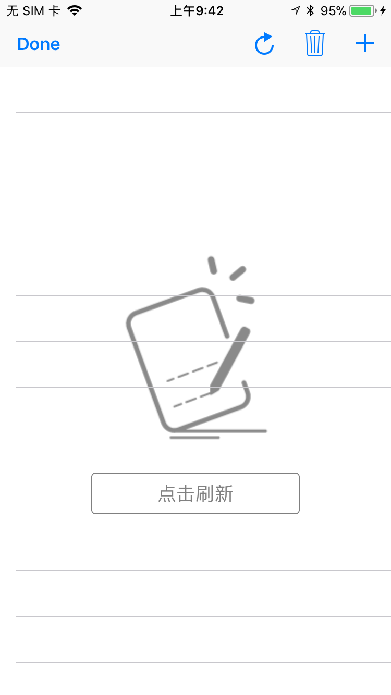

# XCNoDataPlaceholder

[]()
[]()
[](https://www.apple.com/nl/ios/)

一个超级简单易用的UITableView和UICollectionView的空数据占位图，可区分实现网络错误状态和空数据状态

A super easy-to-use empty data prompt for the UITableView and UICollectionView.
Can distinguish between network error state and empty data state



## USE


```
pod 'XCNoDataPlaceholder'
```

1.import it

2.Implementing the Delegate method


## Protocol

```
/**
 * Empty Data Placeholder Image
 */
- (UIImage *)PlaceholderNoDataImage;

/**
 * Net Error Placeholder Image 
 * if you don't implement it , will used  - PlaceholderNoDataImage
 */
- (UIImage *)PlaceholderNetErrorImage;

/**
 * default size : 200*200
 */
- (CGSize)PlaceholderImageSize;

/**
 * image offset
 */
- (UIOffset)PlaceholderOffset;

/**
 * Refresh Button
 * you can return any UIView instance if you need
 */
- (UIButton *)PlaceholderRefreshButton;

```


## Demo

```
<XCNoDataPlaceholderDelegate>

//-----

_tableView.placeholderImageDelegate = self;
_collectionView.placeholderImageDelegate = self;

//------

- (UIImage *) PlaceholderNoDataImage{
    return [UIImage imageNamed:@"noData"];
}

- (UIImage *)PlaceholderNetErrorImage{
	return [UIImage imageNamed:@"netErr"];
}

- (UIButton *)PlaceholderRefreshButton{
    UIButton * refreshButton = [[UIButton alloc] initWithFrame:CGRectMake(0, 0, 200, 40)];
    return refreshButton;
}


```

## Net Error identifier

```
e.p.
[[AFNetworkReachabilityManager sharedManager]setReachabilityStatusChangeBlock:^(AFNetworkReachabilityStatus status) {
    if (status == AFNetworkReachabilityStatusNotReachable) {
        xcPlaceholderNetState = NO;
    }else{
        xcPlaceholderNetState = YES;
    }
}];

```

## Attentions

由于组件是添加在BackgroundView上，所以不能随列表滑动

it cannot slide with the list, Because it's added to the BackgroundView


## Apache License 2.0


